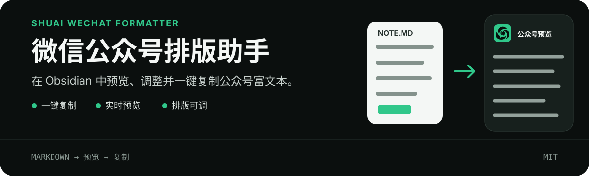

<p align="center">
  
</p>

# Shuai WeChat Formatter

[English](./README.en.md)

一个面向微信公众号写作者的 Obsidian 插件。打开 Markdown 笔记，即可预览公众号排版，并一键复制为可直接粘贴的富文本。

这个插件主打极简：保留常用的排版能力，减少不必要的配置和操作。

## 功能亮点

- 一键复制当前 Markdown 笔记，并自动打开公众号预览。
- 编辑笔记时实时刷新预览，复制结果与预览保持一致。
- 支持字体、配色、行间距和左右页边距调整。
- 支持 Markdown 格式的结尾内容，可用于社群、产品或联系方式。
- 自动将正文外链整理为文末编号引用。
- 全程本地处理，不上传笔记，不发送网络请求，也不收集数据。

## 使用方法

1. 在 Obsidian 中打开一篇 Markdown 笔记。
2. 点击左侧 Ribbon 中的“帅”字按钮。
3. 在预览页检查或调整排版。
4. 进入微信公众号编辑器，直接粘贴。

需要重新复制时，点击预览顶部的「复制公众号格式」。

## 安装

在 Obsidian 中打开：

```text
设置 → 第三方插件 → 浏览 → 搜索 Shuai WeChat Formatter
```

安装并启用即可。

也可以从最新的 GitHub Release 下载 `main.js`、`manifest.json` 和 `styles.css`，放入：

```text
<你的仓库>/.obsidian/plugins/shuai-wechat-formatter/
```

重启 Obsidian，然后在「设置 → 第三方插件」中启用。

## 排版设置

打开「设置 → Shuai WeChat Formatter」，可以配置：

- 「预览」：选择右侧分栏或新标签页。
- 「默认排版」：设置正文字体、配色、行间距和页边距。
- 「结尾内容」：管理需要追加到文章末尾的 Markdown。

预览页中的临时调整会影响下一次复制，但不会覆盖默认设置。

## 支持的 Markdown

| 类型 | 支持情况 |
| --- | --- |
| H1–H6 标题 | 支持 |
| 段落与换行 | 支持 |
| 粗体与斜体 | 支持 |
| 有序、无序列表 | 支持 |
| 引用 | 支持 |
| 行内代码、代码块 | 支持 |
| 链接 | 支持，转换为文末引用 |
| 网络图片 | 支持，保留图片链接 |
| 表格、分隔线 | 支持 |
| Obsidian `![[本地图片]]` | 不支持自动上传 |

## 图片处理

本插件不提供图片上传和存储。文章中的图片需要使用可公开访问的网络链接；插件会保留这些链接，但不会自动处理 Obsidian 的 `![[本地图片]]`。

我自己的方案是 [Image Auto Upload Plugin](https://github.com/renmu123/obsidian-image-auto-upload-plugin) 配合 [PicGo](https://picgo.github.io/PicGo-Doc/)：

1. 在 PicGo 中配置自己的图床。
2. 使用 Image Auto Upload Plugin 自动上传本地图片。
3. 图片上传后，笔记中的本地引用会替换为网络链接。
4. 再使用本插件复制公众号格式。

Image Auto Upload Plugin 和 PicGo 负责图片上传，本插件只负责排版和复制。它们是推荐搭配，不是本插件的强制依赖。

## 链接与引用源

微信公众号编辑器无法稳定保留普通外链。插件会在链接原位置添加编号，并把网址集中到文章最后：

```markdown
查看 [Obsidian](https://obsidian.md)
```

转换后类似：

```text
查看 Obsidian[1]

引用源
[1] Obsidian
    https://obsidian.md
```

## 隐私

插件不发送网络请求，不收集数据，也不保存文章副本。笔记内容只在当前 Obsidian 窗口中转换，并在点击复制时写入系统剪贴板。

## 已知限制

- 当前没有针对 Obsidian 移动端做完整实机验证。
- 微信公众号可能继续过滤部分 HTML 或样式，发布前请检查粘贴结果。

## 支持作者

如果这个插件帮你省下了一点排版时间，欢迎请我喝杯豆浆 ☕️

<p align="center">
  
</p>

## 本地开发

需要 Node.js 18 或更高版本。

```bash
git clone git@github.com:qizong007/shuai-ob-wx-offi-plugin.git
cd shuai-ob-wx-offi-plugin
npm install
npm test
npm run build
```

欢迎提交 Issue 或 Pull Request。涉及微信公众号样式兼容性的修改，请同时提供 Obsidian 预览和微信公众号编辑器粘贴结果。

## License

[MIT](./LICENSE)
